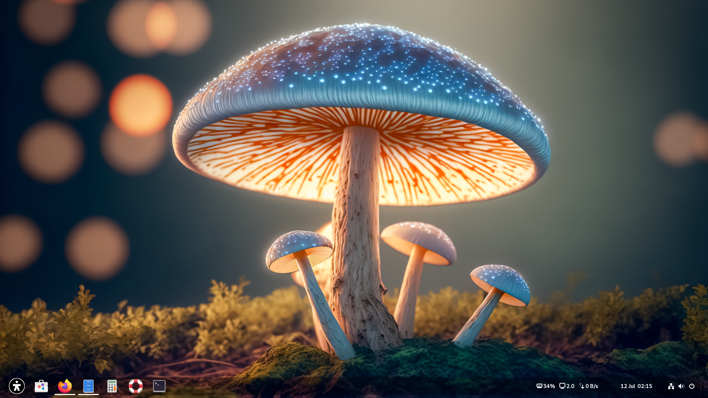
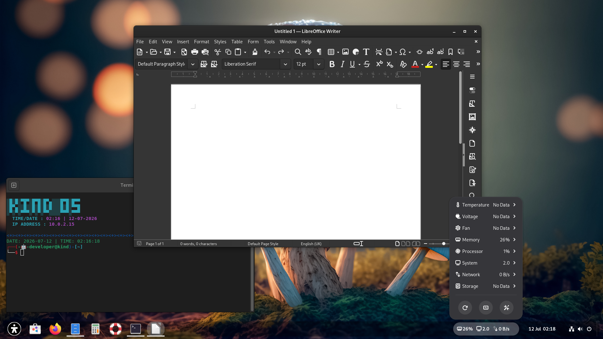
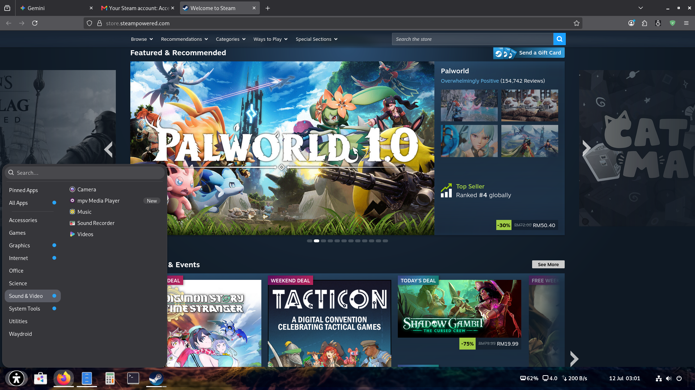

# KindOS Project:

# KindOS: A Seamless Computing Experience

**KindOS** is more than just an operating system; it is the answer to your desire for a device that works *for* you, not against you. We have meticulously crafted KindOS with one core philosophy: to provide a **clean, lightning-fast, and intuitive environment** that lets you focus entirely on what matters most.

## Why Choose KindOS?

Moving from Windows? You will feel right at home, but with a level of freedom you’ve never imagined. We have stripped away the unnecessary complexity that bogs down typical systems, replacing it with rock-solid stability and a polished, modern aesthetic that makes every session a pleasure.

*   **Speed & Responsiveness:** Experience a system that is incredibly lightweight. No more heavy, unnecessary background processes eating up your memory.
*   **Modern Aesthetics:** A thoughtfully designed interface—minimal, focused, and elegant—providing a visually soothing experience throughout your workday.
*   **Effortless Transition:** We’ve curated the best alternative software for you. You don’t have to sacrifice productivity; your daily office, creative, and media needs are met with tools that are more efficient and entirely free.
*   **Privacy & Empowerment:** With KindOS, you regain ownership of your data and your workflow. You are always in full control.

## Transitioning from Windows

We understand that changing your habits is a challenge. That is why KindOS comes equipped with **seamless software alternatives** to replace the tools you relied on in Windows:

*   **Office Productivity:** Tackle your documents and spreadsheets with suites that are fully compatible with your existing files.
*   **Creativity & Media:** Access professional-grade image and video editing tools without the burden of expensive, recurring license fees.
*   **Simplified Management:** Say goodbye to forced updates and complex account requirements. Installing and managing software is now smarter, faster, and hassle-free.

## Project Structure

*   `src/`: The core engine, fine-tuned for peak performance.
*   `scripts/`: Automated utilities designed to make system customization a breeze.
*   `assets/`: The unique, high-quality branding and visual identity of KindOS

## License

KindOS is licensed under the [GNU General Public License v3.0](LICENSE).

---
*Built with passion by M. Haniff Zain.*
